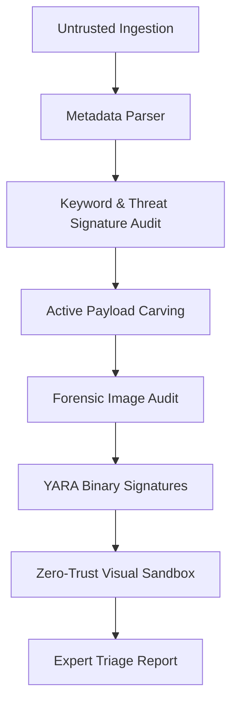

# 🛡️ PNAL: Proactive Network & Analysis Laboratory
## **Enterprise Architectural Manual & Technical Documentation**
*Powered by the PANL (PDF Analysis Toolkit) Forensic Engine*
*Version: 2.0.0 (Production-Grade)*
*Classification: Commercial Security Standard*

---

## 📑 1. Architectural Rebranding Memorandum
During the software lifecycle, the core engine underwent an identity expansion:
*   **PANL (PDF Analysis Toolkit)**: The underlying, low-level developmental library and modular scanning engine. It retains its technical namespace (`panl/` package folder) to ensure backward compatibility and prevent circular reference breaks.
*   **PNAL (Proactive Network & Analysis Laboratory)**: The unified, commercial-grade enterprise visual suite, interactive dashboard, and command-line program presented to security analysts and forensic triagers.

This manual documents the final production-ready state of **PNAL**, detailing how its underlying **PANL** modules orchestrate to deliver air-gapped document triage, zero-trust visual sandboxing, and automated malware hunting.

---

## ⚙️ 2. High-Level Pipeline Architecture
PNAL implements a highly parallelized, linear scanning pipeline that analyzes untrusted PDF and Office files. The system is designed to execute completely offline (except for an optional API correlation to VirusTotal), guaranteeing secure, leakage-free operations inside military and intelligence networks.

### 🔄 The Seven-Phase Triage Loop


1.  **Ingestion & Dissection**: Decouples zip containers (docx, xlsx, pptx) or xref byte streams (pdf).
2.  **Metadata Extraction**: Analyzes binary structure stamps, creation dates, and author manipulation trails.
3.  **Active Payload Carving**: Surgically extracts embedded compressed `.bin` or OLE files, computes SHA256 hashes, and indexes them.
4.  **Forensic Image Audit**: Examines images (SVG/PNG/JPG) for SVG vector script injection or steganographic payloads.
5.  **Offline Signature Scan**: Evaluates files against compiled YARA signature sets.
6.  **Secure Sandbox Rendering**: Injects custom Content Security Policy (CSP) headers to preview files safely.
7.  **Expert Decision Matrix**: Correlation of findings into an actionable, color-coded analyst threat index.

---

## 📦 3. Module-by-Module Technical Specification

### 🖥️ `panl/cli.py` (Command Line Entrypoint)
*   **Role**: Direct command-line interaction and local terminal triage.
*   **Learnings/Experience**: Integrated a dynamic root-path injection (`sys.path.insert`) to resolve package paths without requiring global system environmental variables.

### 🌐 `panl/web.py` (Web Dashboard Server)
*   **Role**: Serves the visual dashboard, charts, live report generation, and upload endpoints.
*   **Learnings/Experience**: Implemented dynamic path helpers (`get_user_path` and `get_resource_path`) to enable seamless execution both as a local Flask instance and inside compiled standalone binaries.

### 💾 `panl/database.py` (Persistence Engine)
*   **Role**: Handles SQLite connection, database initialization (`init_db`), and saving/retrieving structured scan records.
*   **Schema**:
    *   `scans` Table: `id` (INTEGER PRIMARY KEY), `filename` (TEXT), `file_hash` (TEXT UNIQUE), `risk_score` (INTEGER), `findings_json` (TEXT), `created_at` (TIMESTAMP).

### 🔍 `panl/modules/engine.py` (Triage Orchestrator)
*   **Role**: The master engine that coordinates all modular sub-scanners, correlates threat vectors, and computes the final risk index.

### 📄 `panl/modules/metadata.py` (Container Audit)
*   **Role**: Parses author signatures, software producer origins, page counts, and modifications. Detects temporal manipulation (e.g., future creation dates).

### 🏷️ `panl/modules/keywords.py` (Threat Trait Detector)
*   **Role**: Identifies suspicious functional directives (like `/JS`, `/JavaScript`, `/OpenAction`, `/Launch`, `/EmbeddedFile`) inside the document stream.

### ⚠️ `panl/modules/javascript.py` (Active Script Analyzer)
*   **Role**: Audits JavaScript content extracted from PDF structures, evaluating it for obfuscation, high-entropy blocks, or dangerous commands (e.g., `eval`, `unescape`).

### 🌐 `panl/modules/iocs.py` (Network Indicator Harvester)
*   **Role**: Uses optimized regular expressions to scrape and index URLs, IPv4/IPv6 addresses, and email signatures hidden within binary containers.

### 📊 `panl/modules/behavior.py` (Threat Indicator Mapping)
*   **Role**: Generates a granular analyst logs timeline outlining malicious and suspicious indicators found.

### 🧮 `panl/modules/risk_score.py` (Threat Heuristics Engine)
*   **Role**: A multi-weighted mathematical matrix that evaluates structural findings (Metadata, YARA matches, active scripts, carved objects) to assign a finalized score from `0` (Clean) to `100` (Critical).

### 🎯 `panl/modules/offline_scan.py` (YARA Scanning Loop)
*   **Role**: Dynamically compiles and runs local signature sets located under the `rules/` directory to scan documents completely offline.

### 📡 `panl/modules/vt_check.py` (Global Intelligence correlation)
*   **Role**: Communicates with the public VirusTotal API using the client's optional API key to correlate local results with 70+ commercial antivirus engines.

### 🗃️ `panl/modules/office.py` (OLE / Office Carving)
*   **Role**: Employs `oletools.olevba` to parse Microsoft Office files, identify VBA macros, and extract OLE objects safely.

### 🖼️ `panl/modules/ocr.py` (Image Evasion Audit)
*   **Role**: Evaluates embedded image structures for SVG script insertion, PHP webshell signatures, or steganography vectors.

### 🤖 `panl/modules/expert_system.py` (Expert Decision Report)
*   **Role**: Analyzes the accumulated forensic indicators and translates them into an advanced, plain-English summary outlining specific TTPs (Tactics, Techniques, and Procedures).

---

## 🧪 4. Zero-Trust Web Sandbox Architecture
To protect analysts from dynamic script triggers, PNAL enforces a strict **Digital Blast Shield** during document inspection:

1.  **Strict Content Security Policy (CSP)**:
    *   During visual preview, the web server injects strict security headers:
        ```http
        Content-Security-Policy: default-src 'self'; script-src 'none'; object-src 'self'; connect-src 'none';
        ```
    *   This forces the browser to disable all dynamically executing scripts, inline scripts, and outbound AJAX or fetch requests.
2.  **Structural Active Trigger Neutralization**:
    *   Active execution parameters (e.g., `/JS` or `/OpenAction` triggers in PDFs) are neutralised at the byte stream level before rendering.

---

## 🚀 5. Air-Gapped Deployment & Portability

### 🖥️ Windows Standalone Compilation
PNAL features complete compatibility with **PyInstaller** for zero-dependency standalone builds:
*   **Dynamic Asset Bundling**: Inside compiled format, static templates and YARA rules are read directly from memory (`sys._MEIPASS` temp folder).
*   **Persistent Writing**: Writable configurations (`config.json`), log archives, and database files (`panl.db`) are dynamically saved in the directory containing the compiled `pnal.exe` (`sys.executable` folder).

### 🤖 CI/CD Automation (GitHub Actions)
I implemented a robust **GitHub Actions** runner (`build-exe.yml`) that automates Windows binary compilation on push:
```yaml
name: Build Windows Portable Executable
on: [push]
jobs:
  build:
    runs-on: windows-latest
    steps:
      - uses: actions/checkout@v4
      - uses: actions/setup-python@v5
        with:
          python-version: '3.11'
      - run: pip install -r requirements.txt pyinstaller
      - run: pyinstaller --onefile --name pnal --add-data "panl/templates;panl/templates" --add-data "rules;rules" --paths . panl/cli.py
```
This guarantees that tactical analysts in the field have immediate, zero-touch access to the standalone Windows executable.
